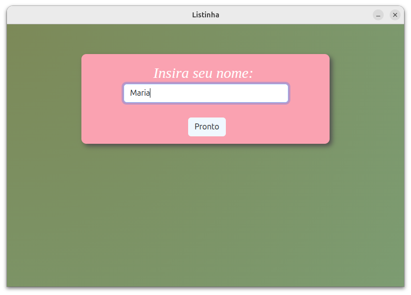
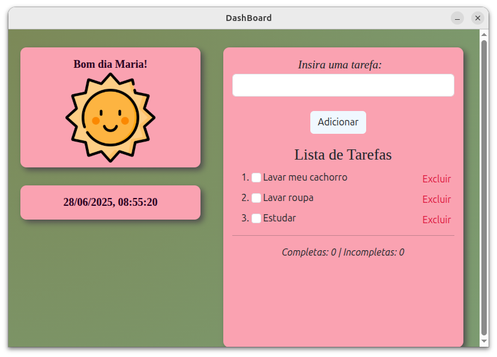

# 🗂️ To-Do Dashboard com Electron

Uma aplicação desktop simples de lista de tarefas, com saudação personalizada, relógio e contagem de tarefas completas e incompletas. Desenvolvida com **HTML**, **CSS**, **JavaScript** e **Electron**.

---

## ✨ Funcionalidades

- 👤 Saudação personalizada com nome do usuário e horário do dia (Bom dia/Boa noite)
- 🕒 Exibição da data e hora atual no carregamento
- ✅ Adição de tarefas
- 📝 Edição de tarefas diretamente na lista
- ❌ Exclusão de tarefas
- 📊 Contadores automáticos de tarefas completas e incompletas
- ☀️ Ícones dinâmicos de sol e lua com base no horário
- 💾 Armazenamento de nome com `localStorage`

---

## 🖼️ Interface

 <!-- Você pode adicionar uma imagem da sua tela aqui -->
 
---

## 🚀 Como executar

### Pré-requisitos:
- Node.js instalado

### Passos:

1. Clone o repositório:
   ```bash
   git clone https://github.com/seu-usuario/seu-repositorio.git
   cd seu-repositorio


2. Instale o electron:
   npm iinit
   npm install electro


3. Rode o projeto no terminal
   npm start
    
